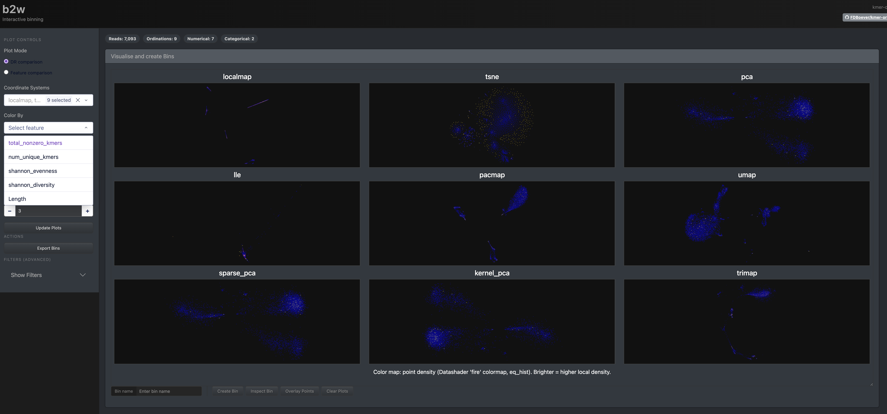

# README

## WEB SERVER

### This container doesn't work, but at least has the webserver working that can be used for binning

To get the web server running, had to run it like this:

```bash
docker run -it -p 8050:8050  -v "$PWD":/work  -w /work  --entrypoint /bin/bash  mpampuch/kmerord_aa22b13_linux-amd64:236dec627bd6c001
```

And then to be able to open the webserver on a brower, I had to run the command like this within the container

```bash
kmer-ord bin --host 0.0.0.0 --db path/to/kmerord.sqlite 
```

#### WEBSERVER STATUS

I don't know if the webserver is working as expected because I don't see any way to integrate the tiara results into the visualization




I know tiara ran correctly for this run:

```
$ head testtodayalldr/tiara/log_63_Monoraphidiumcircinale.hifi_reads.subsampled.5percent_tiara.tsv 

First iteration statistics:
	archaea: 4
	bacteria: 1630
	eukarya: 4456
	organelle: 655
	unknown: 37
Second iteration statistics:
	mitochondrion: 85
	plastid: 563
	unknown: 7
```


### Current container status

Running `kmer-ord setup` outputs this:

```
Verifying external tools... ──────────────────────────────────────────────────────────
    WARNING  kmer-counter failed verification
    WARNING  tiara failed verification
    barrnap detected and working
    flye detected and working
    minimap2 detected and working
    samtools detected and working
    Rscript detected and working
```

## Build issues

-20260707: Tried to build the file on my arm64 Mac with emulation but it failed due to `CPU ISA level is lower than required`. Might be able to only do it with wave for now

```bash
docker buildx build \
  --platform linux/amd64 \
  -t kmer-ord:amd64_aa22b13 \
  .
```

Output:

```
Caused by:
process didn't exit successfully: `/tmp/kmerord_rust_tool_build/target/release/build/crc32fast-36b67569e3688557/build-script-build` (exit status: 127)
--- stderr
/tmp/kmerord_rust_tool_build/target/release/build/crc32fast-36b67569e3688557/build-script-build: CPU ISA level is lower than required
warning: build failed, waiting for other jobs to finish...
ERROR conda.cli.main_run:execute(148): `conda run cargo build --release` failed. (See above for error)
```