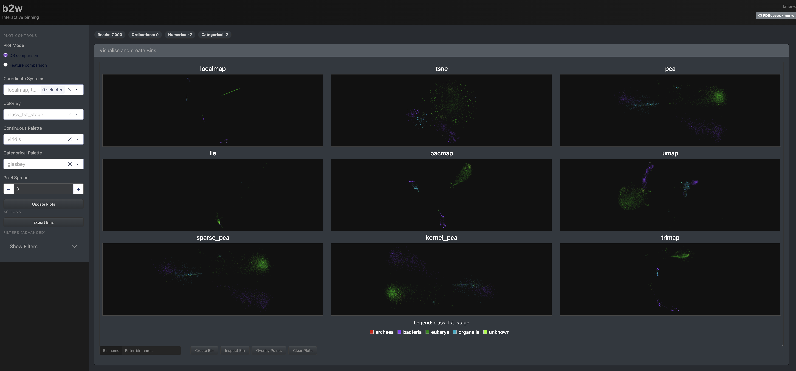
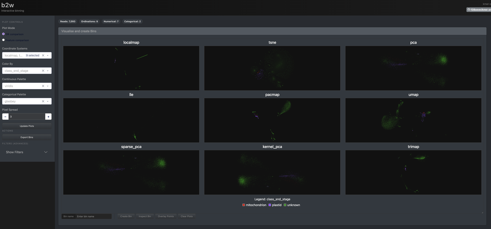

# README

## WEB SERVER

### This container doesn't work, but at least has the webserver working that can be used for binning

To get the web server running, had to run it like this:

```bash
# Stop any existing processes that are allocating the port
docker container stop $(docker ps | rg 8050 | awk '{print $1}')
# Run the container
docker run -it -p 8050:8050  -v "$PWD":/work  -w /work  --entrypoint /bin/bash  mpampuch/kmerord_aa22b13_linux-amd64:236dec627bd6c001
```

And then to be able to open the webserver on a brower, I had to run the command like this within the container

```bash
kmer-ord bin --host 0.0.0.0 --db path/to/kmerord.sqlite 
```

#### WEBSERVER STATUS 

Working after manually downgrading matplotlib during build but encountering the following bugs:

1. Currently pixel-spread seems to break the web app:

After changing pixel spread I got this:

```
ERROR in app: Exception on /_dash-update-component [POST]
Traceback (most recent call last):
  File "/opt/conda/lib/python3.11/site-packages/flask/app.py", line 1511, in wsgi_app
    response = self.full_dispatch_request()
               ^^^^^^^^^^^^^^^^^^^^^^^^^^^^
  File "/opt/conda/lib/python3.11/site-packages/flask/app.py", line 919, in full_dispatch_request
    rv = self.handle_user_exception(e)
         ^^^^^^^^^^^^^^^^^^^^^^^^^^^^^
  File "/opt/conda/lib/python3.11/site-packages/flask/app.py", line 917, in full_dispatch_request
    rv = self.dispatch_request()
         ^^^^^^^^^^^^^^^^^^^^^^^
  File "/opt/conda/lib/python3.11/site-packages/flask/app.py", line 902, in dispatch_request
    return self.ensure_sync(self.view_functions[rule.endpoint])(**view_args)  # type: ignore[no-any-return]
           ^^^^^^^^^^^^^^^^^^^^^^^^^^^^^^^^^^^^^^^^^^^^^^^^^^^^^^^^^^^^^^^^^
  File "/opt/conda/lib/python3.11/site-packages/dash/backends/_flask.py", line 264, in _dispatch
    response_data = ctx.run(partial_func)
                    ^^^^^^^^^^^^^^^^^^^^^
  File "/opt/conda/lib/python3.11/site-packages/dash/_callback.py", line 784, in add_context
    raise err
  File "/opt/conda/lib/python3.11/site-packages/dash/_callback.py", line 775, in add_context
    output_value = _invoke_callback(func, *func_args, **func_kwargs)  # type: ignore[reportArgumentType]
                   ^^^^^^^^^^^^^^^^^^^^^^^^^^^^^^^^^^^^^^^^^^^^^^^^^
  File "/opt/conda/lib/python3.11/site-packages/dash/_callback.py", line 59, in _invoke_callback
    return func(*args, **kwargs)  # %% callback invoked %%
           ^^^^^^^^^^^^^^^^^^^^^
  File "/opt/conda/lib/python3.11/site-packages/kmer_ord/dash/b2w.py", line 1605, in update_multiple_coord_plots
    base_img = create_datashader_image(
               ^^^^^^^^^^^^^^^^^^^^^^^^
  File "/opt/conda/lib/python3.11/site-packages/kmer_ord/dash/b2w.py", line 425, in create_datashader_image
    img = tf.spread(img, px=max(int(px_spread), 1))
                                ^^^^^^^^^^^^^^
TypeError: int() argument must be a string, a bytes-like object or a real number, not 'NoneType'
```

2. Advanced filtering crashes the app instead of failing gracefully if the filters seem to be conflicting or nonsense:

Setting `class_fst_stage` to `eukarya` and `class_snd_stage` to `plastid` and pressing `Update` gave me this:

```
192.168.65.1 - - [07/Jul/2026 14:33:56] "POST /_dash-update-component HTTP/1.1" 200 -
[2026-07-07 14:34:05,519] ERROR in app: Exception on /_dash-update-component [POST]
Traceback (most recent call last):
  File "/opt/conda/lib/python3.11/site-packages/flask/app.py", line 1511, in wsgi_app
    response = self.full_dispatch_request()
               ^^^^^^^^^^^^^^^^^^^^^^^^^^^^
  File "/opt/conda/lib/python3.11/site-packages/flask/app.py", line 919, in full_dispatch_request
    rv = self.handle_user_exception(e)
         ^^^^^^^^^^^^^^^^^^^^^^^^^^^^^
  File "/opt/conda/lib/python3.11/site-packages/flask/app.py", line 917, in full_dispatch_request
    rv = self.dispatch_request()
         ^^^^^^^^^^^^^^^^^^^^^^^
  File "/opt/conda/lib/python3.11/site-packages/flask/app.py", line 902, in dispatch_request
    return self.ensure_sync(self.view_functions[rule.endpoint])(**view_args)  # type: ignore[no-any-return]
           ^^^^^^^^^^^^^^^^^^^^^^^^^^^^^^^^^^^^^^^^^^^^^^^^^^^^^^^^^^^^^^^^^
  File "/opt/conda/lib/python3.11/site-packages/dash/backends/_flask.py", line 264, in _dispatch
    response_data = ctx.run(partial_func)
                    ^^^^^^^^^^^^^^^^^^^^^
  File "/opt/conda/lib/python3.11/site-packages/dash/_callback.py", line 784, in add_context
    raise err
  File "/opt/conda/lib/python3.11/site-packages/dash/_callback.py", line 775, in add_context
    output_value = _invoke_callback(func, *func_args, **func_kwargs)  # type: ignore[reportArgumentType]
                   ^^^^^^^^^^^^^^^^^^^^^^^^^^^^^^^^^^^^^^^^^^^^^^^^^
  File "/opt/conda/lib/python3.11/site-packages/dash/_callback.py", line 59, in _invoke_callback
    return func(*args, **kwargs)  # %% callback invoked %%
           ^^^^^^^^^^^^^^^^^^^^^
  File "/opt/conda/lib/python3.11/site-packages/kmer_ord/dash/b2w.py", line 1605, in update_multiple_coord_plots
    base_img = create_datashader_image(
               ^^^^^^^^^^^^^^^^^^^^^^^^
  File "/opt/conda/lib/python3.11/site-packages/kmer_ord/dash/b2w.py", line 416, in create_datashader_image
    agg = cvs.points(df_ds, x='x', y='y', agg=ds.count_cat('cat_value'))
          ^^^^^^^^^^^^^^^^^^^^^^^^^^^^^^^^^^^^^^^^^^^^^^^^^^^^^^^^^^^^^^
  File "/opt/conda/lib/python3.11/site-packages/datashader/core.py", line 232, in points
    return bypixel(source, self, glyph, agg)
           ^^^^^^^^^^^^^^^^^^^^^^^^^^^^^^^^^
  File "/opt/conda/lib/python3.11/site-packages/datashader/core.py", line 1359, in bypixel
    return bypixel.pipeline(source, schema, canvas, glyph, agg, antialias=antialias)
           ^^^^^^^^^^^^^^^^^^^^^^^^^^^^^^^^^^^^^^^^^^^^^^^^^^^^^^^^^^^^^^^^^^^^^^^^^
  File "/opt/conda/lib/python3.11/site-packages/datashader/utils.py", line 118, in __call__
    return lk[typ](head, *rest, **kwargs)
           ^^^^^^^^^^^^^^^^^^^^^^^^^^^^^^
  File "/opt/conda/lib/python3.11/site-packages/datashader/data_libraries/pandas.py", line 17, in pandas_pipeline
    return glyph_dispatch(glyph, df, schema, canvas, summary, antialias=antialias)
           ^^^^^^^^^^^^^^^^^^^^^^^^^^^^^^^^^^^^^^^^^^^^^^^^^^^^^^^^^^^^^^^^^^^^^^^
  File "/opt/conda/lib/python3.11/site-packages/datashader/utils.py", line 121, in __call__
    return lk[cls](head, *rest, **kwargs)
           ^^^^^^^^^^^^^^^^^^^^^^^^^^^^^^
  File "/opt/conda/lib/python3.11/site-packages/datashader/data_libraries/pandas.py", line 48, in default
    bases = create((height, width))
            ^^^^^^^^^^^^^^^^^^^^^^^
  File "/opt/conda/lib/python3.11/site-packages/datashader/compiler.py", line 301, in <lambda>
    return lambda shape: tuple(c(shape, array_module) for c in creators)
                         ^^^^^^^^^^^^^^^^^^^^^^^^^^^^^^^^^^^^^^^^^^^^^^^
  File "/opt/conda/lib/python3.11/site-packages/datashader/compiler.py", line 301, in <genexpr>
    return lambda shape: tuple(c(shape, array_module) for c in creators)
                               ^^^^^^^^^^^^^^^^^^^^^^
  File "/opt/conda/lib/python3.11/site-packages/datashader/reductions.py", line 791, in <lambda>
    return lambda shape, array_module: self.reduction._build_create(
                                       ^^^^^^^^^^^^^^^^^^^^^^^^^^^^^
  File "/opt/conda/lib/python3.11/site-packages/datashader/reductions.py", line 418, in _build_create
    raise NotImplementedError(f"Unexpected dshape {dshape}")
NotImplementedError: Unexpected dshape <function dshape at 0x7fff77d384a0>
```

#### Questions:

1. Is there a way to combine `class_fst_stage` and `class_snd_stage` results from Tiara? I want to see all the eukaryotic, bacterial, and archael results + the organelles partitioned into mitochondria and plastid in one view?





2. What does `Overlay Points` do?

3. Are there any recommendations on choosing good kmer sizes to maximize separations between the clusters and/or also for the individual dimensionality reduction techniques, any recommendations for choosing the best hyperparameters (either based on the chosen kmer size or independent of it) to get the best clustering of reads based on their origin?

##### Also some improvements for Frederiks team

1. You can't zoom into the plots and use the lasso at the same time it seems. Would be nice to do that if possible (may be hard because it seems based on an external library that's responsible for the visualization) because sometimes its difficult to grab all the right points

2. Related to that, when inspecting bins, it would be nice if you could directly filter out points you don't want before exporting them. A search option to help the filtering would be nice too.


### Current container status

Running `kmer-ord setup` outputs this:

```
Verifying external tools... ──────────────────────────────────────────────────────────
    WARNING  kmer-counter failed verification
    WARNING  tiara failed verification
    barrnap detected and working
    flye detected and working
    minimap2 detected and working
    samtools detected and working
    Rscript detected and working
```

## Build issues

`20260707`: Tried to build the file on my arm64 Mac with emulation but it failed due to `CPU ISA level is lower than required`. Might be able to only do it with wave for now

```bash
docker buildx build \
  --platform linux/amd64 \
  -t kmer-ord:amd64_aa22b13 \
  .
```

Output:

```
Caused by:
process didn't exit successfully: `/tmp/kmerord_rust_tool_build/target/release/build/crc32fast-36b67569e3688557/build-script-build` (exit status: 127)
--- stderr
/tmp/kmerord_rust_tool_build/target/release/build/crc32fast-36b67569e3688557/build-script-build: CPU ISA level is lower than required
warning: build failed, waiting for other jobs to finish...
ERROR conda.cli.main_run:execute(148): `conda run cargo build --release` failed. (See above for error)
```
